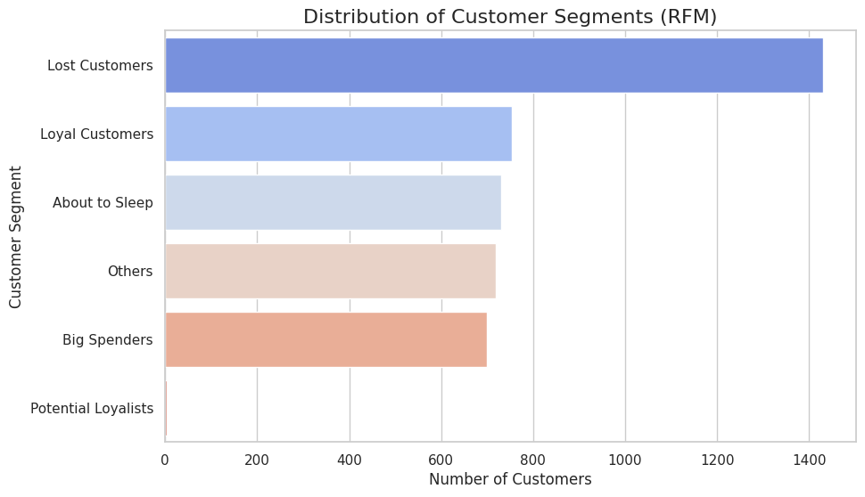

# Identify Loyal & Lost Customers – Online Retail Analysis

This project analyzes customer behavior from a online retailer to identify **loyal**, **lost**, and **potential** customers using **RFM analysis** (Recency, Frequency, Monetary).

View on Kaggle: [Identify Loyal & Lost Customers + Best Products](https://www.kaggle.com/code/ranjanrakesh51/identify-loyal-lost-customers-best-products)

---

## Project Objectives

* Segment customers based on purchasing behavior
* Use **RFM analysis** to classify customers
* Identify top-performing customers and lost ones
* Find best-selling products and top revenue generators
* Enable better **targeted marketing** and **customer retention**

---

## Dataset

* **Source**: [Custom Dataset on Kaggle](https://www.kaggle.com/datasets/ranjanrakesh51/online-retail)
* **Description**: Contains transactions between 01/12/2010 and 09/12/2011
* **Columns**: InvoiceNo, StockCode, Description, Quantity, InvoiceDate, UnitPrice, CustomerID, Country

---

## Methods Used

* Data cleaning (removing missing IDs, canceled orders)
* Feature engineering:

  * `TotalPrice` = `Quantity * UnitPrice`
  * `InvoiceMonth`, `Day`, etc.
* **RFM scoring**:

  * Recency: Days since last purchase
  * Frequency: Total number of purchases
  * Monetary: Total spending
* Quantile-based scoring and segment labeling
* Customer segmentation and visual insights

---

## Key Results

* Top 5 countries by revenue and customer count
* Best-selling and most returned products
* Revenue trend by month
* Loyal, at-risk, and lost customer groups
* RFM Segmentation Bar Chart




---

## Tools & Libraries

* Python
* Pandas, NumPy
* Seaborn, Matplotlib
* Datetime, Plotly (optional for interactivity)

---

## How to Run

1. Clone the repository:

```bash
git clone https://github.com/rakesh1251/Identify-Loyal_Lost-Customers.git
```

2. Open `identify-loyal-lost-customers-best-products.ipynb` in Jupyter or upload it to [Kaggle Notebooks](https://www.kaggle.com/code/ranjanrakesh51/identify-loyal-lost-customers-best-products)
3. Run cells sequentially

---

## Last Update

**June 2025**

---

## Author

**Rakesh Ranjan**
GitHub: [rakesh1251](https://github.com/rakesh1251)
Kaggle: [ranjanrakesh51](https://www.kaggle.com/ranjanrakesh51)

---

## License

This project is open for learning and portfolio use.
